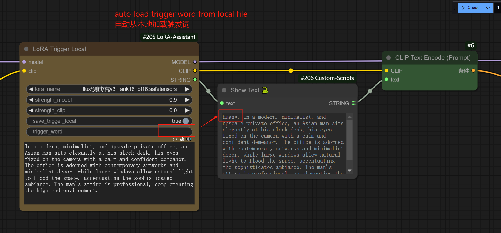

# ComfyUI-LoRA-Assistant

## Introduction 简介
The plug-in is designed to automatically save the association between the LoRA model and Trigger words to a Local JSON file so that when the LoRA model is loaded, the associated trigger words can be automatically loaded via the node "LoRA Trigger Local" without manual input.

该插件旨在自动将LoRA模型和触发词之间的关联关系保存到本地JSON文件中，以便在加载LoRA模型时，可以通过节点“LoRA Trigger Local”自动加载关联的触发词，无需手动输入。

## Installation 安装
1. Go to comfyUI custom_nodes folder, `ComfyUI/custom_nodes/` 打开Comfyui插件目录
2. git clone https://github.com/Bellzs/ComfyUI-LoRA-Assistant.git 克隆此仓库

## Usage 使用教程
### LoRA Trigger Local节点

#### save_trigger_local
- When 'trigger_word' is not empty, whether it is set to the trigger word of this lora so that the trigger word is loaded automatically later.After saving, you can still modify the LoRA file name, which does not affect the association with the trigger word.
- 当‘trigger_word’不为空时，是否将其设置为该LoRA的触发词，以便后续自动加载触发词。保存后，你依然可以修改LoRA文件名，这并不影响与触发词的关联关系。
#### trigger_word
- Manually set the trigger word. If it is empty, the last saved trigger word is automatically loaded.
- 手动设置触发词。如果为空，则自动加载上次保存的触发词。
#### positive_prompt
- The positive prompt other than the trigger word, if it is not empty, is automatically concated with the trigger word to form the final text output.
- 除触发词外的正面提示词，若它不为空，则将自动与触发词拼接成最后的文本输出内容。

## Acknowledgments 致谢
Thanks to the LoadLoraWithTags plugin author, I learned some of its code logic when developing this plugin.
感谢LoadLoraWithTags插件作者，我在开发本插件时借鉴了它的部分代码逻辑：
[LoadLoraWithTags](https://github.com/Extraltodeus/LoadLoraWithTags)

## Submit an issue if you have a good suggestion 如果你有好的建议，可提交issue

